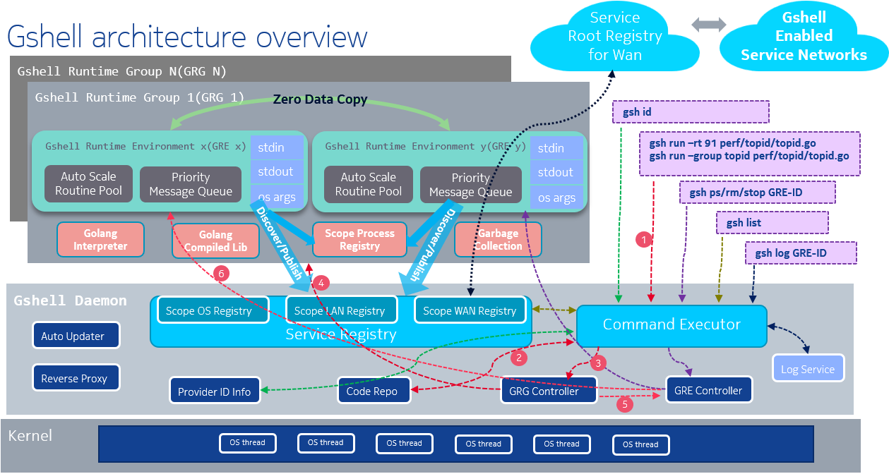

# Introduction

gshell is gshellos based service management tool.  
gshellos is a simple pure golang service framework for linux devices that provides:

- Flexible running model
  - Mixed execution mode to run go apps/services
    - interpreted mode for flexibility, compiled mode for performance
    - mix-used in runtime, easy to switch
  - Isolated Gshell Runtime Environment(GRE)
    - one service/app runs in one GRE
    - GRE has separate OS input, output, args
    - GREs share memory by communicating
  - App/service group mechanism
    - GREs can be grouped to run in one Gshell Runtime Group(GRG)
    - applicable real-time scheduling policy on GRG
    - zero communication cost in same GRG: zero data copy, no kernel round trip
    - group/ungroup by gshell command line at runtime
  - Remote deployment
- Simplified and unified communication
  - Name based service publishing/discovery
    - a service is published under the name of {"publisher", "service"}
    - 4 scopes of service visibility: Process, OS, LAN, WAN
    - a service can be published in all the above scopes
    - a service is discovered in the above scope order
  - Message oriented client-server communication
    - servers define message structs, clients import message structs
    - simple Send(msg) Recv(msgPtr) API and RPC alike SendRecv(msgSnd, msgRcvPtr) API
    - data encoding/serializing when necessary
    - messages can be reordered by predefined priority
  - High concurrency model
    - client side multiplexed connection
    - server side auto scale worker pool
    - of course go routines and go channels
- Zero deploy dependency on all CPU arch
  - X86, ARM, MIPS, PPC...
  - embedded boxes, cloud containers, server VMs...
  - only one binary is needed
- Zero cost for service/app migration between different scopes/machines/locations
  - no code change, no recompile, no redeploy
  - gshell command line to move services/apps around at runtime
- Auto update without impacting the running services
- Interactive and native debugging with built-in REPL shell
- P2P network model
  - zero config, self discovered and managed network
  - auto reverse proxy for service behind NAT

# Architecture

# Docs

- [Interpreted mode VS compiled mode](docs/interpreter.md)
- [Deploy gshell daemon](docs/daemon.md)
- [Run go apps/services in GRE and GRG](docs/gregrg.md)
- [Service and message](docs/adaptiveservice.md)
- [Command line guide](docs/userguide.md)
- [Debugging using interactive shell](docs/debugging.md)

# See also

- [adaptiveservice](https://github.com/godevsig/adaptiveservice)
- [grepo](https://github.com/godevsig/grepo)
