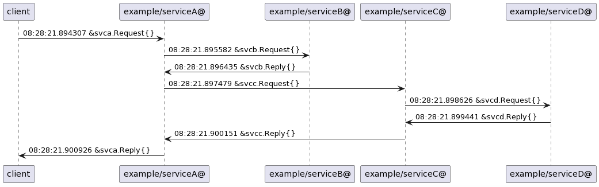
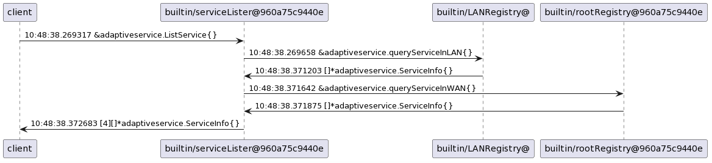

The [adaptiveservice](https://github.com/godevsig/adaptiveservice) message tracing framework enables dynamic full-service mesh message tracing. Message tracing operates at the transport level and remains transparent to user code.

# Demo example

For example, in the following scenario:
1. A client sends a request to Service A.
2. While handling the request, Service A depends on Service B and Service C.
3. Service B does not depends on any other service.
4. Service C, in turn, depends on Service D.
5. After Service D returns a response to Service C, Service C then returns its response to Service A.
6. Finally, Service A returns the final response to the client.

By adding a special 'traced' flag to the client-side request message, it becomes possible to record all messages related to processing the flagged request.

After the recording is complete, one can read all the collected messages. The output of the records for the above scenario is as follows:

```shell
Summary(paste below content to http://www.plantuml.com/plantuml):
"client" -> "example/serviceA@": 08:28:21.894307 &svca.Request{}
"example/serviceA@" -> "example/serviceB@": 08:28:21.895582 &svcb.Request{}
"example/serviceB@" -> "example/serviceA@": 08:28:21.896435 &svcb.Reply{}
"example/serviceA@" -> "example/serviceC@": 08:28:21.897479 &svcc.Request{}
"example/serviceC@" -> "example/serviceD@": 08:28:21.898626 &svcd.Request{}
"example/serviceD@" -> "example/serviceC@": 08:28:21.899441 &svcd.Reply{}
"example/serviceC@" -> "example/serviceA@": 08:28:21.900151 &svcc.Reply{}
"example/serviceA@" -> "client": 08:28:21.900926 &svca.Reply{}
```

We can use http://www.plantuml.com/plantuml to generate the chart:



To verify the above example, go to `adaptiveservice/examples/msgtracing`
```shell
# run servers
make runs

# run client
make runc
```

# Trace messages in gshellos commandline
`gsh mtrace list` can lists available message types, which can then be used to `gsh --trace msgTypeName`
```shell
cd gshellos
alias gsh='bin/gshell'
# build gshell
make full

# start gshell daemon
gsh -loglevel info daemon -wd .working -registry 127.0.0.1:11985 -bcast 9923 -root -repo github.com/godevsig/ghub/master &

# list traceable message type names
gsh mtrace list

# trace message type *adaptiveservice.ListService while doing gsh list command
gsh --trace *adaptiveservice.ListService list
# trace multiple message types
gsh --trace *adaptiveservice.ListService,*adaptiveservice.queryServiceInLAN,*adaptiveservice.queryServiceInWAN list

# no tracing
gsh list
```

Tracing result:



# Dynamic tracing
Message tracing can be enabled per message type dynamically, without any code modification and recompiling.

In this scenario, we have a service called 'echoservice' running. The 'echoclient' sends hundreds of `echo.Request` messages to the server, and we want to trace how `echo.Request` is going to be processed. It's important to note that message tracing operates on a session-based approach, and here's how it works:
1. We tag message type `echo.Request` with a special 'traced' flag, return a unique token.
2. The client consumes the token upon sending a `echo.Request` because it matches 'traced' message type. Each token is specific to a session and gets consumed, so subsequent messages of type echo.Request won't be traced unless tagged again.
3. When the server-side handles an `echo.Request`, all messages involved in processing that request, in the order they occur, are tagged as 'traced' messages (see the demo example). In this scenario, we don't have dependent messages, so the server responds with `echo.Reply` to the client.
4. Events related to the client sending, server receiving, server sending, and client receiving are recorded throughout the tracing process.
5. We use the token to access traced records. The records will be read and then cleared.

## Trace single session
```shell
cd gshellos
alias gsh='bin/gshell'
# build gshell
make full

# start gshell daemon
gsh -loglevel info daemon -wd .working -registry 127.0.0.1:11985 -bcast 9923 -root -repo github.com/godevsig/ghub/master &

# run echo server
gsh run example/echo/server/echoserver.go

# run echo client, no tracing
gsh run -group echoclient example/echo/client/echoclient.go

# show tasks
$ gsh ps
## output
GRE ID        IN GROUP            NAME                START AT             STATUS
52129def8ddf  echoclient-v2.0.1   echoclient          2023/09/19 12:32:13  exited:OK  12.390925943s
c493ceaf848c  uzfayo-v2.0.1       echoserver          2023/09/19 12:26:13  running    11m37.875056216s

# same as gsh mtrace list
gsh run -group echoclient -rm -i testdata/tracemsg.go list

# tag echo.Request, must run it in the same group(-group option) with echo client
gsh run -group echoclient -rm -i testdata/tracemsg.go tag echo.Request
## output Tracing <echo.Request> with token 7ab68ca9-f2b1-4901-a470-4be0f536dc94.0

# rerun echo client
gsh start echoclient

# show tracing result, read clear
gsh run -rm -i testdata/tracemsg.go show 7ab68ca9-f2b1-4901-a470-4be0f536dc94.0
```

`tracemsg.go show` showed the results below:
```log
Traced records with token: 7ab68ca9-f2b1-4901-a470-4be0f536dc94.0
12:32:13.909378 [client send] |unix: @ <--> @adaptiveservice/example_echo.v1.0.sock| <echo.Request{Msg:"ni hao", Num:100}>
12:32:13.909901         [example/echo.v1.0@0f4de739464d handler] |unix: @adaptiveservice/example_echo.v1.0.sock <--> @| <echo.Request{Msg:"ni hao", Num:100}>
12:32:14.411228         [example/echo.v1.0@0f4de739464d send] |unix: @adaptiveservice/example_echo.v1.0.sock <--> @| <echo.Reply{Request:echo.Request{Msg:"ni hao!", Num:101}, Signature:"yours echo.v1.0 from 12"}>
12:32:14.411652 [client recv] |unix: @ <--> @adaptiveservice/example_echo.v1.0.sock| <echo.Reply{Request:echo.Request{Msg:"ni hao!", Num:101}, Signature:"yours echo.v1.0 from 12"}>

Summary(paste below content to http://www.plantuml.com/plantuml):
"client" -> "example/echo.v1.0@0f4de739464d": 12:32:13.909901 echo.Request{}
"example/echo.v1.0@0f4de739464d" -> "client": 12:32:14.411652 echo.Reply{}
```

## Trace sequential sessions
```shell
cd gshellos
alias gsh='bin/gshell'
# build gshell
make full

# start gshell daemon
gsh -loglevel info daemon -wd .working -registry 127.0.0.1:11985 -bcast 9923 -root -repo github.com/godevsig/ghub/master &

# run echo server
gsh run example/echo/server/echoserver.go

# run echo client, no tracing
gsh run -group echoclient example/echo/client/echoclient.go

# show tasks
$ gsh ps
## output
GRE ID        IN GROUP            NAME                START AT             STATUS
52129def8ddf  echoclient-v2.0.1   echoclient          2023/09/19 12:32:13  exited:OK  12.390925943s
c493ceaf848c  uzfayo-v2.0.1       echoserver          2023/09/19 12:26:13  running    11m37.875056216s

# same as gsh mtrace list
gsh run -group echoclient -rm -i testdata/tracemsg.go list

# tag echo.Request, must run it in the same group(-group option) with echo client
# also provide count option to trace the message type multiple times
gsh run -group echoclient -rm -i testdata/tracemsg.go tag echo.Request count 9
## output Tracing <echo.Request> with token ac098704-9971-4810-b338-8398ec27bf78.0..8

# rerun echo client
gsh start echoclient

# show tracing result, read clear
gsh run -rm -i testdata/tracemsg.go show ac098704-9971-4810-b338-8398ec27bf78.0..8
```

Sequential tracing session result includes many session results, from `ac098704-9971-4810-b338-8398ec27bf78.0` to `ac098704-9971-4810-b338-8398ec27bf78.8`, with each one displayed separately.
```

## The help

`tracemsg.go` help:
```shell
$ gsh run -rm -i testdata/tracemsg.go -h
testdata/tracemsg.go <list|tag ...|untag ... |show ...|purge>

list:
    list traceable message type names
tag <msgNameList> [count <number>]:
    Tag the message types specified in <msgNameList> for tracing and return tracing tokens.
    <msgNameList> is a comma-separated list containing the names of the message types.
    Each token corresponds one tracing session associated with a message type.
    The tracing stops after sending <number> messages maching specified message type, generating
    a set of sequential tokens sharing the same prefix, in below form if number is 100:
    750768e4-f572-4c4e-9302-46d84c756361.0..99
    The default value for <number> is 1.
untag <all|msgNameList>:
    Untag all message types that have been tagged or the message types specified in <msgNameList>.
show <tokenList>:
    Display the tracing results specified by a list of tokens.
    <tokenList> is a comma-separated list containing tracing tokens.
purge:
    Read and remove all traced messages for all tracing sessions, including those triggered by others.
    CAUTION: this will trigger a force cleanup across all service nodes, resulting missing traced message
    records for other tracing sessions even on remote nodes.
```
